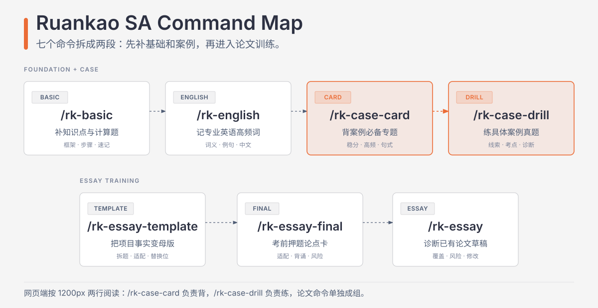

# 软考系统架构设计师 Skills

把软考高级系统架构设计师备考拆成五个可调用的 AI 教练：基础知识、专业英语、案例分析、论文模板生成、论文草稿诊断。

`ruankao-sa-skills` 适合在复习知识点、记专业英语、拆案例题、整理项目素材、生成论文母版和打磨论文草稿时使用。每个 Skill 都有自己的工作流、参考资料和输出边界，可以单独调用，也可以按备考节奏串起来。

<div align="center">
  
</div>

## What You Get

| Skill | 你遇到的问题 | 它会产出什么 |
| --- | --- | --- |
| `/rk-basic` | 选择题知识点看不懂、计算题不会拆步骤、易混概念记不牢 | 考点解释、计算步骤、知识框架、考前速记 |
| `/rk-english` | 专业英语 5 道题想快速记高频词，不想看太长解析 | 按专题分类的英语词汇、中文含义、真题或考点例句中文意思 |
| `/rk-case` | 案例题题干抓不住、答案不知道漏了哪些采分点 | 题干线索、考点定位、分问答题框架、失分诊断 |
| `/rk-essay-template` | 有真实项目材料，想按不同论文题目整理一份考场可改写母版 | 题目拆解、真题映射、主题适配、架构师视角检查、论点卡、可替换论文模板 |
| `/rk-essay` | 已经写出论文草稿，但不知道是否覆盖题干、哪里容易失分 | 题目覆盖诊断、项目事实检查、训练估分、优先修改项 |

推荐节奏：先用 `rk-basic` 补知识点，用 `rk-english` 记高频专业英语，再用 `rk-case` 训练分问作答，接着用 `rk-essay-template` 把真实项目整理成可替换母版，最后用 `rk-essay` 检查草稿的题干覆盖和过线风险。

## Quick Start

推荐用 `npx skills` 安装，适合 Codex、Claude Code、Cursor 等支持 `SKILL.md` 的 Agent：

```bash
npx skills@latest add YinJax/ruankao-sa-skills -a codex -g --skill rk-basic --skill rk-english --skill rk-case --skill rk-essay --skill rk-essay-template -y
```

安装后新开一个任务，让客户端重新加载 Skill，然后直接调用：

```text
/rk-case 拆解下面这道案例题，指出我的答案漏了哪些采分点。
```

如果你的 `skills` CLI 会自动发现仓库根目录下的 `skills/`，也可以使用更短的安装命令：

```bash
npx skills@latest add YinJax/ruankao-sa-skills -a codex -g -y
```

已经安装过的用户，直接重新执行上面的安装命令即可更新到最新版本。更新后新开一个任务，让客户端重新加载 Skill。

## Install

### Recommended: `npx skills`

安装指定的五个 Skill：

```bash
npx skills@latest add YinJax/ruankao-sa-skills -a codex -g --skill rk-basic --skill rk-english --skill rk-case --skill rk-essay --skill rk-essay-template -y
```

把 `codex` 换成你的目标 Agent，例如 `claude-code`、`cursor` 或其它 `skills` CLI 支持的 Agent。

### Update Existing Install

已经用 `npx skills` 安装过时，重新执行同一条 `add` 命令即可覆盖为仓库最新版本：

```bash
npx skills@latest add YinJax/ruankao-sa-skills -a codex -g --skill rk-basic --skill rk-english --skill rk-case --skill rk-essay --skill rk-essay-template -y
```

只更新论文模板命令：

```bash
npx skills@latest add YinJax/ruankao-sa-skills -a codex -g --skill rk-essay-template -y
```

更新后关闭当前任务并新开一个任务，确保客户端重新加载最新的 `SKILL.md`。

### Codex Plugin

```bash
codex plugin marketplace add YinJax/ruankao-sa-skills
codex plugin add rk@rk
```

安装后新开一个任务，让 Codex 重新加载插件。

### Claude Code Plugin

```text
/plugin marketplace add YinJax/ruankao-sa-skills
/plugin install rk@rk
```

安装后新开一个任务，让 Claude Code 重新加载插件。

## Examples

补基础知识：

```text
/rk-basic 帮我解释流水线吞吐率怎么计算，并给一道练习题。
```

记专业英语：

```text
/rk-english 输出“安全”专题的 10 个高频词，只列英语词汇、中文和例句中文意思。
```

拆案例题：

```text
/rk-case 题干如下，帮我提取关键线索、定位考点，并检查我的答案漏了哪些采分点。
```

先生成论文母版：

```text
/rk-essay-template 根据论文题目、真题要求和我的项目事实，生成一份可替换的考场写作模板；理论部分用论点卡展开，并检查是否站在架构师视角。
```

诊断论文草稿：

```text
/rk-essay 根据题目、项目事实和我的草稿，诊断这篇论文的过线风险，给出训练估分和优先修改项。
```

串联复习：

```text
先用 /rk-basic 帮我补齐 Redis 缓存一致性的基础知识，再用 /rk-case 帮我整理案例题答题框架。
```

## Boundaries

训练估分只用于复习判断，不等同于官方阅卷结果，也不承诺通过考试。

Skill 不会虚构题干、项目数据、技术栈、评分细则或官方政策。报名时间、考试安排、大纲和地区政策等信息，请以当次官方通知为准。

生成内容适合用来复习、诊断和考场前改写。`rk-essay-template` 输出的是可替换母版，不是万能范文；`rk-essay` 给出的训练估分和修改建议也不能替代官方阅卷。

## For Maintainers

这个仓库同时支持 `npx skills` 和 native plugin 两种分发方式：

- 根目录 [`skills/`](skills) 是 `npx skills` 的公开 Skill 源。
- [`plugins/rk/skills`](plugins/rk/skills) 是 Codex / Claude Code plugin 安装所需的镜像副本。
- 修改 Skill 时，优先改根目录 `skills/`，再同步到 plugin 目录。

发布前检查两套内容是否一致：

```powershell
powershell -NoProfile -File scripts/sync-plugin-skills.ps1 -Check
```

如果修改了根目录 Skill，再同步到 plugin：

```powershell
powershell -NoProfile -File scripts/sync-plugin-skills.ps1
```

## Structure

```text
ruankao-sa-skills/
├── .agents/plugins/marketplace.json
├── .claude-plugin/marketplace.json
├── skills/
│   ├── rk-basic/
│   ├── rk-english/
│   ├── rk-case/
│   ├── rk-essay/
│   └── rk-essay-template/
├── plugins/rk/
│   ├── .codex-plugin/plugin.json
│   ├── .claude-plugin/plugin.json
│   └── skills/
│       ├── rk-basic/
│       ├── rk-english/
│       ├── rk-case/
│       ├── rk-essay/
│       └── rk-essay-template/
├── scripts/sync-plugin-skills.ps1
├── LICENSE
└── README.md
```

## License

MIT
